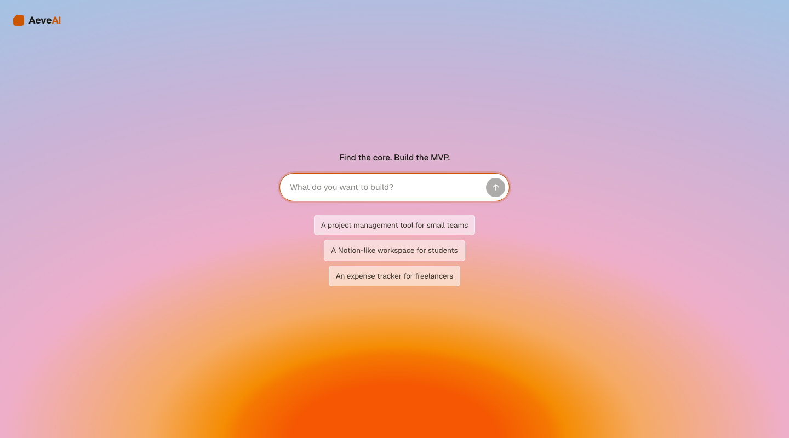

# AeveAI



An AI product-building assistant that takes a vague product idea, decides what
the first version actually needs, and builds a small working prototype — in
that order, on purpose.

Type one sentence — *"a Notion-like workspace for university students"* — and
watch it move through a pipeline: **Idea → Product DNA → Reduction → MVP →
Technical Plan → Build**. The centerpiece is Reduction: AeveAI enumerates the
broad feature set the product could have, then cuts most of it, with a
specific reason for every exclusion. Nothing gets removed silently — every cut
can be challenged, and AeveAI argues its case rather than quietly re-adding
the feature.

## Status

This is a hackathon proof of concept, built incrementally and honestly. Right
now: **Idea input, Product DNA, and Reduction (with Challenge) are working
end to end against the real Claude API.** MVP, Technical Plan, and the Build
stage (the four building blocks — CRUD, search, dashboard, document/editor)
are not implemented yet.

See [`devpost/checklist.md`](devpost/checklist.md) for exact build progress
and a log of every decision that changed mid-build (provider swap, styling
changes, etc.) with the reasoning behind it.

## Stack

- **Next.js 16** (App Router) + **TypeScript** + **React 19** — one app, UI
  and server route together
- **Anthropic SDK** (`@anthropic-ai/sdk`), model pinned to **`claude-sonnet-5`**
  — Structured Outputs via `output_config.format` + `zodOutputFormat()`
- **Zod v4** — single source of truth for every stage's shape, validated at
  runtime and converted to the JSON Schema Claude needs
- **Tailwind CSS v4 + shadcn** for the landing screen; the rest of the app is
  plain CSS custom properties. Both coexist deliberately — see
  `devpost/spec.md > Stack`
- No database, no separate backend. State is designed to live in
  `localStorage` once the Build stage ships

## Setup

Requirements: Node.js 20+ (built and tested on Node 26.7.0 / npm 11.19.0).

```bash
npm install
```

Create `.env.local` in the project root (never committed — see `.gitignore`):

```
ANTHROPIC_API_KEY=sk-ant-...
```

Get a key at [console.anthropic.com](https://console.anthropic.com). It's read
server-side only, inside the API route — never sent to the browser. Without a
key the app still loads the empty state; only submitting an idea fails, with
a clear error message pointing back here.

```bash
npm run dev
```

Open [http://localhost:3000](http://localhost:3000).

## Trying it

Type an idea, or click one of the three examples (this prefills the input —
it doesn't submit). Watch Product DNA appear, then Reduction split into
**Core MVP** and **Left Out**, each exclusion with a specific reason. Click
**"Challenge this decision"** on an excluded feature to see AeveAI make its
case for the cut.

To see the honest-refusal path, try a non-product input ("build me a
sandwich") or a vague one ("an app") — AeveAI asks for more context instead
of inventing a product.

## Project docs

The planning documents that drove this build live in [`devpost/`](devpost/):

- [`scope.md`](devpost/scope.md) — the product's unique kernel and PoC boundary
- [`prd.md`](devpost/prd.md) — full requirements and acceptance criteria
- [`spec.md`](devpost/spec.md) — technical architecture and stack decisions
- [`checklist.md`](devpost/checklist.md) — build progress, slice by slice, plus every revision recorded with why it happened
